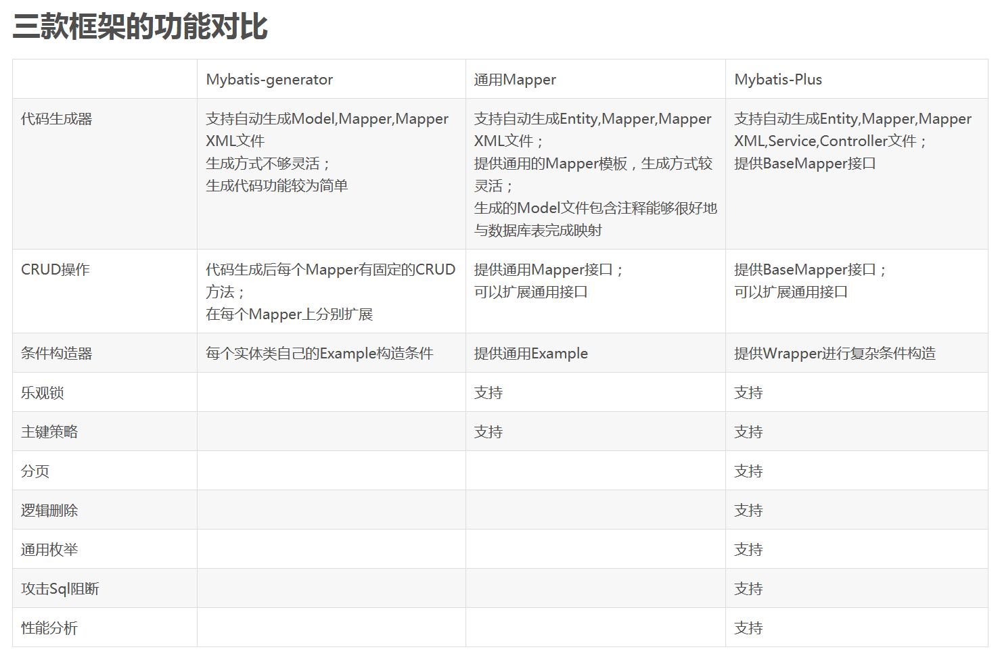

### mybatis-generator（常用） 表数据可以在配置文件配置

### spring-boot-mybatis-generator 表数据不支持在配置文件配置

### generator-biz 代码生成存放目录

### mapper 自动生成框架对比

### 参考

Spring Boot MyBatis集成MyBatis-Plus

https://mp.weixin.qq.com/s/4B4CYOW4_oApz_nLreR4dg